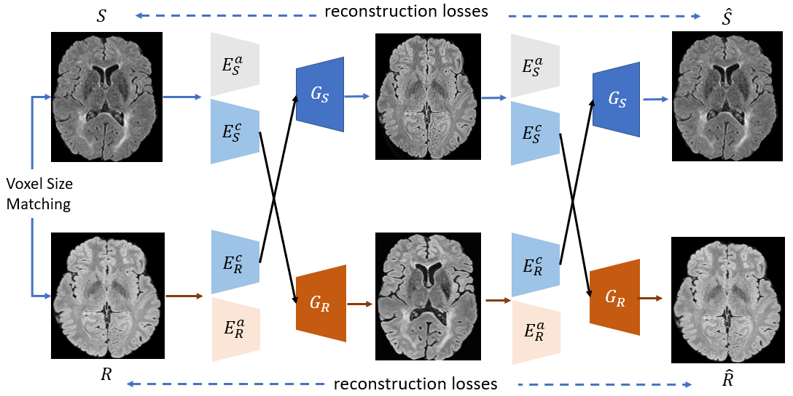
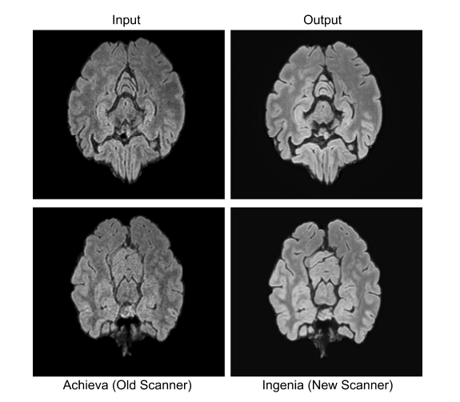
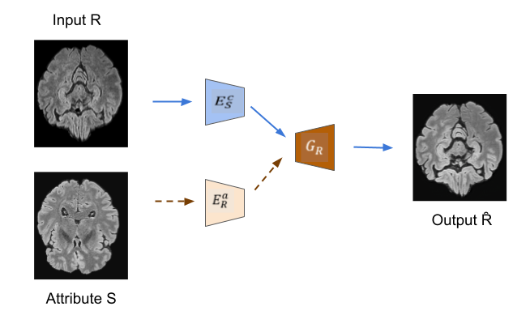
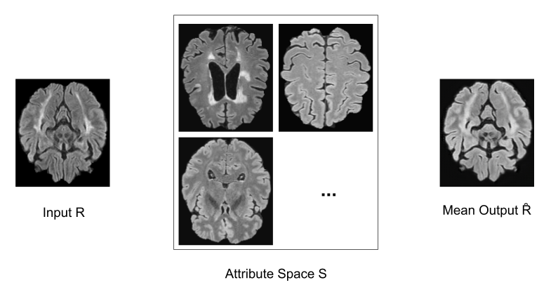

# Multi Modal Medical Image Synthesis 
An unsupervised multi-modal image synthesis network with using Generative Adversarial Networks. Performs translations using the concept of disentagled representations. Disentangled representations invloves mapping the image space into a domain invariant common content space and a domain specific attribute space as shown in the figure. The model performs traslations by obatainting the content from domain S and extracting the attribures from domain R.



This network has been to data homogenization of different MRI datasets. The network performs super resolution and can handle multi modal MRI data sequences (Eg: Flair, T1)

## Example Output




## Requirements

- Python 3.5 or Python 3.6
- Pytorch 0.4.0 and torchvision (https://pytorch.org/)
- [TensorboardX](https://github.com/lanpa/tensorboard-pytorch)
- [Tensorflow](https://www.tensorflow.org/) (for tensorboard usage)
- We provide a Docker file for building the environment based on CUDA 9.0, CuDNN 7.1, and Ubuntu 16.04.

## Dataset folder structure
### Single Modality 
Dataset structure should be as follows where trainA and trainB contains images from domain A and domain B respectively.

 ```
    |-- Datset
    |   |-- trainA
    |   |-- trainB
    |   |-- testA
    |   |-- testB
 ```

### Multi-modal data
When using multi-modal data, the folder structure should be as follows:

```
  |-- Dataset
  |   |-- FLAIR
  |       |-- trainA
  |       |-- trainB
  |       |-- testA
  |       |-- testB
  |   |-- T1
  |       |-- trainA
  |       |-- trainB
  |       |-- testA
  |       |-- testB
 ```
 
## Training
The modal can traied to perform super resolution and can also take multi-modal data. In order to train the model, execute the following command with the specified arguments:
```
python3 train.py --dataroot ../path/to/dataset --name NAME --display_dir DISPLAY_DIR --result_dir RESULT_DIR --multi_modal 1
tensorboard --logdir DISPLAY_DIR/NAME
```
where 
- dataroot: path to the dataset, where the data is stored is stored in the format as shown in the above section
- display_dir: path of the directory where the tensorboard results will be stored
- result_dir: path of the directory where the model file wil be stored
- mutli_modal: flag which specifies if the data is multi modal where 1 is multi-modal data and 0 a single data mode
- resize_size: specifies the image image size. In case of the super resolution task, specify the size of the higher resolution image set.
- input_dim_a: dimension of images train set A. 3 for RGB images and 6 in case of multi-modal data as the the images are concaetnated.
- input_dim_b: dimension of images train set B. 3 for RGB images and 6 in case of multi-modal data as the the images are concaetnated.


## Inference with sampled attribues
The model output is obtained using input from domain R for the content, and extracting the attributes from an image in the domain S, as shown in
the figure. By extracting the attributes from multiple images in domain R, multiple outputs can be produced.



### Multiple outputs

```
python3 test_transfer.py --dataroot ./datasets/path -name NAME --output_dir OUTPUT_DIR --resume --multimodal 0 --average 0 --a2b 1 --num 3
```

where 
- dataroot: path to the dataset, where the data is stored is stored in the format as shown in the above section
- output_dir: path of the directory where the model file wil be stored
- mutli_modal: flag which specifies if the data is multi modal where 1 is multi-modal data and 0 a single data mode
- average: specifies if the output images should be avrerged or not, 1 if averaged and 0 for multiple output images
- a2b: direction of translation, 1 for translation from A to B and 0 for B to A.
- num: number of outputs per input image

### Mean Output Inference

The attribute vector is image-specific, i.e., different images in the reference space result in slightly different attribute representations. This induces a distribution over the translation of one content representation from the source space. Therefore, Markov sampling is employed over various images
from R per one image from S, and the mean is computed as the final translation, as shown in the figure.



```
python3 test_transfer.py --dataroot ./dataset/path -name NAME --output_dir OUTPUT_DIR --resume --multimodal 0 --average 1 --a2b 1
```

where 
- dataroot: path to the dataset, where the data is stored is stored in the format as shown in the above section
- output_dir: path of the directory where the model file wil be stored
- mutli_modal: flag which specifies if the data is multi modal where 1 is multi-modal data and 0 a single data mode
- average: specifies if the output images should be avrerged or not, 1 if averaged and 0 for multiple output images
- a2b: direction of translation, 1 for translation from A to B and 0 for B to A

### References

Diverse Image-to-Image Translation via Disentangled Representations
Hsin-Ying Lee*, Hung-Yu Tseng*, Jia-Bin Huang, Maneesh Kumar Singh, and Ming-Hsuan Yang
European Conference on Computer Vision (ECCV), 2018


